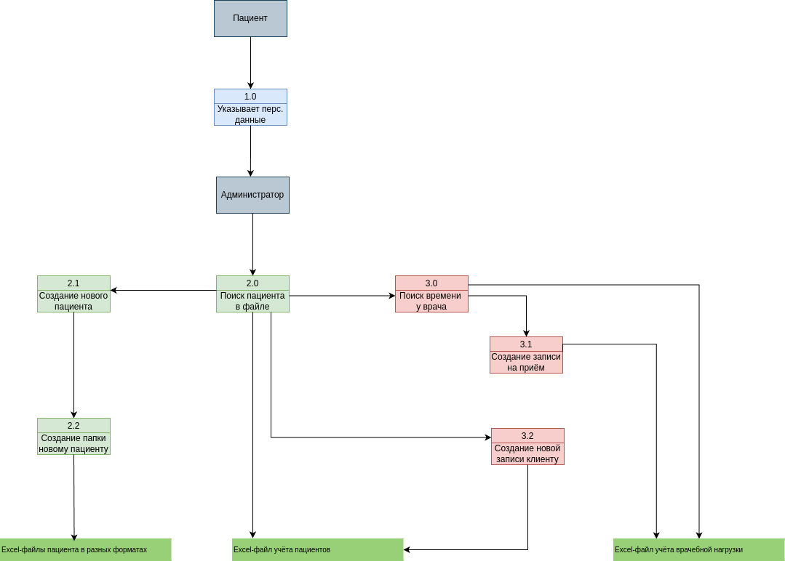
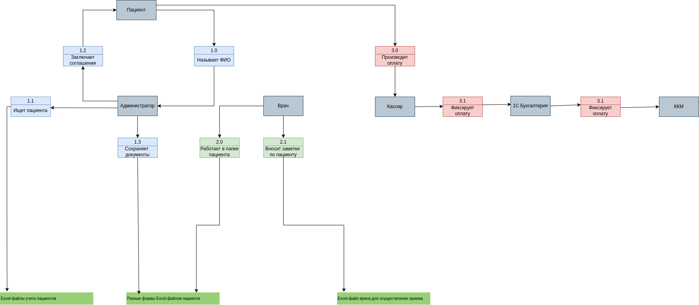
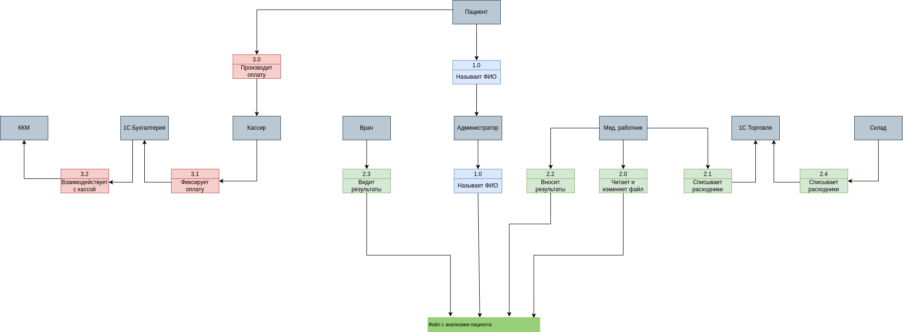

### Структура компании:
Медицинское учреждение из 20 сотрудников и 15 медицинских работников предоставляют медицинские услуги клиентам.
Для этого в офисе компании расположен собственный физический сервер, полный состав сотрудников компании:
- 15 медицинских сотрудников
- 3 сотрудника на ресепшене
- 3 IT-специалиста (тех.директор, администратор сети, бизнес-аналитик)
- 3 кассира
- 3 бухгалтера
- 3 сотрудника склада

При необходимости руководство может выделить ресурсы на найм дополнительных сотрудников.

### Бизнес процессы:
С помощью заполнения Excel файлов и сканов документов в компании реализованы следующие бизнес-процессы
- Запись пациентов
- Учёт пациентов
- Учёт платежей
- Медицинские карты
- Учёт анализов

С помощью 1С.Бухгалтерия системой поддерживается работа с ККМ и реализован процесс:
- Учёт денежных средств

С помощью 1С.Торговля и склад системой поддерживается работа с ТМЦ и реализован процесс:
- Учёт товарно-материальных ценностей (ТМЦ)

### Текущее состояние архитектуры:
У технологической базы компании довольно простой ландшафт. Есть несколько бэк-офис сервисов,
которые закрывают разные потребности. Все IT-продукты построены на разных архитектурных принципах (монолит, общие ресурсы)
и развёрнуты на собственном сервере компании. Он находится в том же здании, что и офис.
Технологический стек компании сейчас выглядит так:
Excel, Outlook и 1С. Их используют для работы на компьютерах в локальной сети компании.
«1С Бухгалтерия предприятия». Программа работает в файловом режиме. Её используют для учёта платежей, начисления зарплаты,
кадрового учёта и подготовки документации для налоговых органов.
«1С Торговля и склад». Тоже работает в файловом режиме. В этой программе ведут учёт товарно-материальных ценностей (ТМЦ).
Физический сервер с Microsoft Windows Server 2022. На нём настроены Active Directory, DNS, DHCP, LDAP, файловый сервер,
Exchange Mail Server. ККМ связаны с сервером через TCP/IP и компоненту 1С по технологии OLE.

### Диаграммы потоков данных в текущей архитектуре:
- Запись пациентов
  
- Прием пациентов
  
- Сбор анализов
  

### Планы руководства:
- Увеличение трафика х5 относительно текущей нагрузки
- Безопасность данных медицинских карт (несанкционированный доступ, утечки)
- Переход от ручной записи данных на единую систему хранение данных
- Хранение данных пользователей в соответствии с требованиями законов РФ, проработать риски утечек

### Цели бизнеса:
1. Интеграция с API лаборатории анализов
2. Расширение обработки данных (BI, ML, AI технологии)
3. Разработка и миграция в новые системы:
    * портал для клиентов
    * портал для сотрудников ресепшена
    * платёжный шлюз
    * CRM для хранения данных клиентов
    * Интеграция с API лаборатории анализов

### Промежуточное состояние (MVP) за 2 месяца:
Клиент может самостоятельно записаться на приём к врачу через портал компании, при этом команда ресепшена должна видеть
эту запись в своей системе, сотрудникам ресепщена нужно иметь возможность за день до записи напомнить клиенту о визите,
а также напомнить врачу о предстоящем приёме. Разбить данные по категориям и разнести их по доменам,
для каждой категории данных использовать RBAC или ABAC.

### Финальное состояние через год:
-  Полностью автоматизированный процесс записи к врачу через портал и моб. приложение.

-  Система имеет возможность присылать клиенту оповещение через мобильное приложение (push-уведомления),
  клиент может подтвердить запись или отменить её, результат подтверждения/отмены должен быть отображен сотрудникам на ресепшен.

-  Пациент может видеть только свои данные (анализы, медицинские заключения, договора),
  данные других пациентов для пациента недоступны.

-  В системе есть возможность помечать тегами данные, которые необходимо защитить.

-  Перед каждым релизом проверяем, что система работает с чувствительными данными в соответствии с ожиданиями:
    - в системе есть наличие данных с категориями: PII, CONFIDENTIAL, FINANCIAL
    - не утекли ли такие данные в логи
    - не передаются ли такие данные в сторонние системы
    - применено ли маскирование
    - применено ли шифрование
    - проведен ли аудит выделенных доменов
    - нет ли нарушения политик безопасности

### Нефункциональные требования системы (НФТ):
- безопасность (чувствительная информация безопасно хранится и обрабатывается, своевременно удаляются,
  прекращать их обрабатывать данные клиента, если клиент об этом запросит)
- масштабируемость (увеличение нагрузки в любых доменах)
- сопровождаемость (легко вносить изменения)
- конфигурируемость (изменения без релизов)